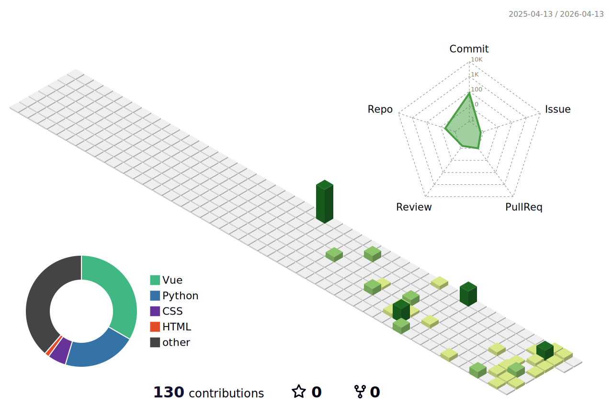

<!-- 现代化动态头部 -->

<!-- 动态打字效果 -->
<h1 align="center">
  
</h1>

<!-- 现代化徽章组 -->

  
  
  
  

<!-- 技能标签云 -->

  
  
  
  
  
  

---

## 📊 GitHub 数据洞察

  
  <!-- 主要统计卡片 -->
  
  
  

<!-- 连击统计 -->

  

<!-- 贡献图表 -->

  

---

## 🌟 精选项目展示

  
  <!-- 项目卡片网格 -->
  <table>
    <tr>
      <td width="50%" align="center">
        

          <h3>🛒 惠农商城练习</h3>
          
<em>现代化电商平台解决方案</em>

          
           
          
          
        

      </td>
      <td width="50%" align="center">
        

          <h3>🚀 FutureBack_end</h3>
          
<em>高性能后端服务架构</em>

          
           
          
          
        

      </td>
    </tr>
  </table>
  
  <!-- 更多项目按钮 -->
  

    
  

  

---

## 🐍 GitHub 活动轨迹

  <h3>📈 代码贡献动态可视化</h3>
  
<em>看看我的代码如何"吃掉"整个贡献图！</em>

  
  <picture>
    <source media="(prefers-color-scheme: dark)" srcset="https://raw.githubusercontent.com/daoxuan233/daoxuan233/main/assets/github-contribution-grid-snake-dark.svg">
    <source media="(prefers-color-scheme: light)" srcset="https://raw.githubusercontent.com/daoxuan233/daoxuan233/main/assets/github-contribution-grid-snake.svg">
    
  </picture>
  
  

    
    
    
  

---

## 🎨 3D 贡献立体图

  <h3>🌟 立体化数据可视化</h3>
  
<em>从三维角度展示我的编程足迹</em>

  
  
  
  

    
    
  

---

## 📫 联系方式

  <h3>🤝 让我们一起创造精彩！</h3>
  
<em>随时欢迎技术交流与合作机会</em>

  
  <!-- 联系方式卡片 -->
  <table>
    <tr>
      <td align="center" width="50%">
        
      </td>
      <td align="center" width="50%">
        
      </td>
    </tr>
  </table>
  
   
  
  <!-- 访问统计 -->
  

    
    
  

  

---

  <h3>💝 感谢您的访问！</h3>
  
<em>如果您觉得我的项目有趣，欢迎给个 ⭐ Star！</em>

  
  <!-- 动态打字效果 -->
  
  
    
  
  <!-- 底部装饰 -->
  

    
    
    
  

  

---

  

