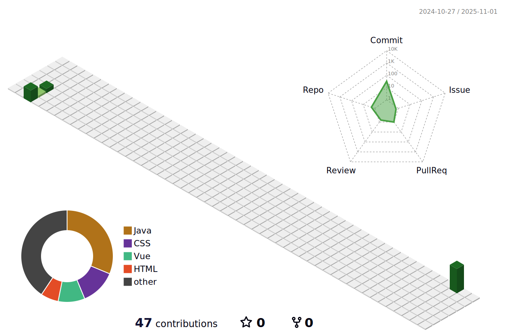

<!-- 主标题区域 -->

<h1 align="center">
  
</h1>

<!-- 统计徽章 -->

  
  
  

---

## 📊 GitHub 统计数据

  <table>
    <tr>
      <td>
        
      </td>
      <td>
        
      </td>
    </tr>
  </table>

---

## 🌟 精选项目

  <table>
    <tr>
      <td width="50%">
        <h3>🛒 惠农商城练习</h3>
        
      </td>
      <td width="50%">
        <h3>🚀 FutureBack_end</h3>
        
      </td>
    </tr>
  </table>

---

## 🐍 GitHub 贡献动态

  <h3>📈 我的 GitHub 活动轨迹</h3>
  

---

## 🎨 3D 贡献图表

  <h3>🌟 3D 贡献可视化</h3>
  

---

## 🤝 联系我

  <h3>💬 让我们一起创造精彩！</h3>
  
  

    
    
    
  

---

  

